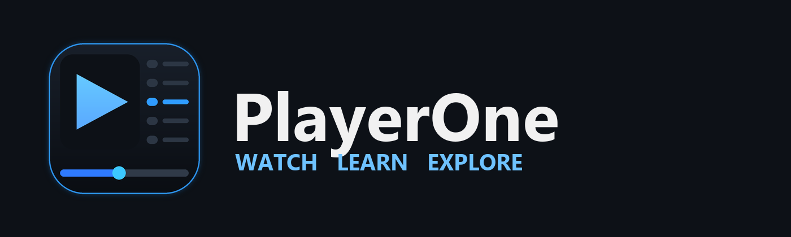
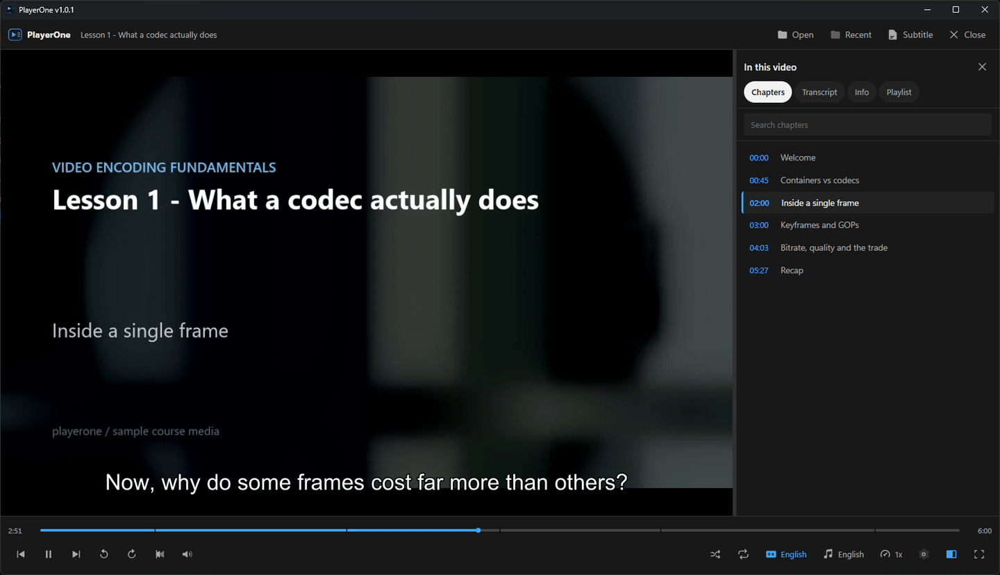
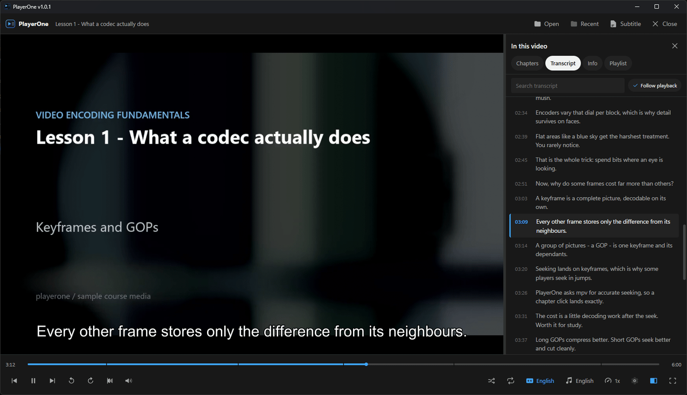
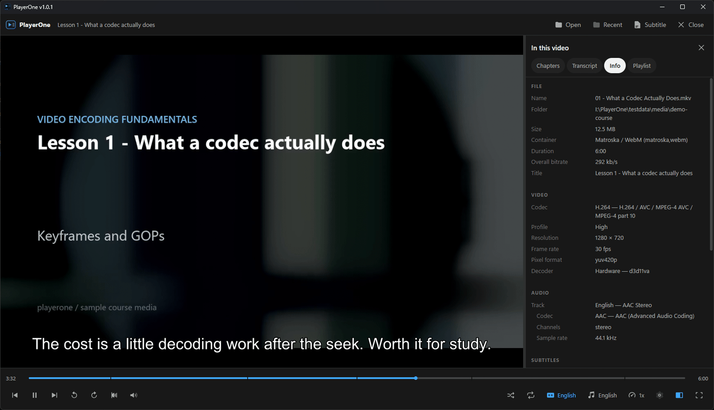
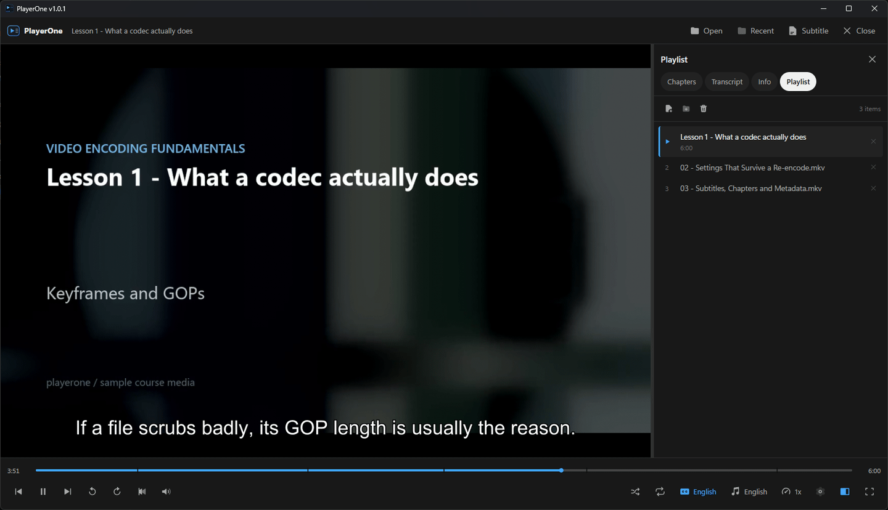

<div align="center">



**A local video player for tutorials and courses, with chapters and a searchable transcript.**

Windows 11 · Go + Wails · mpv

</div>

---

PlayerOne plays video files on your own machine and gives them the thing that
makes a tutorial watchable online: a panel beside the video listing its
**chapters**, its full **transcript**, and what the file actually **is**. Click a
chapter or a line of transcript and the video jumps there.

It uses **mpv** for playback, so it plays whatever mpv plays — MKV with a dozen
audio tracks, embedded subtitles, odd codecs — without you converting anything.

## Features

**Watching**

- Play, pause, seek, volume, mute, fullscreen
- Playback speed from **0.25x to 8x**, with pitch correction so speech stays clear
- **Reverse playback** — real backward decoding, not repeated seeking
- Accurate seeking: a chapter or transcript click lands on the exact moment
- Remembers where you stopped, per file, and offers to resume

**The side panel**

- **Chapters** — every embedded chapter with its timestamp, the current one
  highlighted, searchable, click to jump
- **Transcript** — every subtitle line, timestamped and clickable, following
  playback as it goes, with a search box and a "Follow playback" toggle
- **Info** — container, codecs, resolution, frame rate, bitrates, channel
  layouts, track counts, and which decoder mpv actually chose
- **Playlist** — a queue with shuffle and repeat (off / all / one)

**Tracks and subtitles**

- Switch audio track and subtitle track while playing, with readable names
  (`English — AAC Stereo`, `English Commentary — AC3 5.1`)
- Turn subtitles off entirely
- Load external `.srt`, `.ass`, `.ssa`, `.vtt` and more; files sitting next to
  the video are picked up automatically
- Adjust subtitle **size** and subtitle/audio **delay**

**Getting files in**

- File ▸ Open, drag and drop, or a path on the command line
- Drop several videos, or a folder, to build a playlist
- Appears under Windows' **Open with** for 36 media formats, without taking over
  anything you already use
- Recent files with the position you reached in each
- Tells you when a new version is out, and installs it for you

## Screenshots

**Chapters.** Every embedded chapter with its timestamp, the one you are in
highlighted, and matching marks on the seek bar. Clicking a row jumps there.



**Transcript.** Every subtitle line, timestamped and clickable, scrolling itself
to keep up with playback until you turn *Follow playback* off.



**Info.** What the file actually is — container, codecs, resolution, frame rate,
channel layout — including which decoder mpv chose for it.



**Playlist.** Drop a folder of lessons and it queues in order; shuffle and
repeat live on the control bar.



The lesson in these captures is generated sample media, not a real course.

## Requirements

**To run a release**

- Windows 11 x64 (Windows 10 x64 should work but is not tested)
- The **WebView2 runtime** — already present on Windows 11; the installer adds it
  if it is missing
- Nothing else: mpv and ffmpeg are bundled in the download

**To build from source**

| Tool | Version | Why |
|---|---|---|
| Go | 1.25 or newer | The backend (Wails v2.14 requires it) |
| Node.js | 20 or newer | Building the interface |
| Wails CLI | v2.14.0 or newer | Ties the two together |
| 7-Zip | any | `fetch-tools.ps1` unpacks the mpv build with it |
| NSIS | any | Only needed to build the installer |

No C compiler is required. PlayerOne does not use cgo.

## Development setup

```bash
git clone <your-fork-url> PlayerOne
cd PlayerOne
```

```bash
go install github.com/wailsapp/wails/v2/cmd/wails@latest
```

```bash
wails doctor
```

Then fetch the media tools into `bin/`:

```bash
pwsh scripts/fetch-tools.ps1
```

That downloads mpv, ffmpeg and ffprobe into `bin/`, which is gitignored. It is
the only setup step beyond the toolchain.

### Installing mpv

`scripts/fetch-tools.ps1` does this for you. To do it by hand, download the
Windows build linked from [mpv.io/installation](https://mpv.io/installation/) —
the [shinchiro builds](https://github.com/shinchiro/mpv-winbuild-cmake/releases)
— and put `mpv.exe` in `bin/`.

Alternatively install it system-wide, and PlayerOne will find it on `PATH`:

```bash
winget install mpv.mpv
```

PlayerOne looks for mpv in this order:

1. `bin/` next to `PlayerOne.exe`
2. the folder containing `PlayerOne.exe`
3. `bin/` next to the working directory (this is what `wails dev` uses)
4. anywhere on `PATH`

mpv is **required**. Without it PlayerOne starts and explains exactly where it
looked.

### Installing ffmpeg

Also handled by `scripts/fetch-tools.ps1`. By hand, take a Windows build from
[ffmpeg.org/download](https://ffmpeg.org/download.html) and put `ffmpeg.exe` and
`ffprobe.exe` in `bin/`, or:

```bash
winget install Gyan.FFmpeg
```

ffmpeg is **optional**:

- without `ffmpeg`, transcripts from subtitles *embedded in the video* are
  unavailable (external `.srt` files still work)
- without `ffprobe`, the Info tab shows less detail

Playback is unaffected either way.

### Where to put test videos

Put anything you want to test with in:

```
testdata/media/
```

That folder is **gitignored**, so large files never reach GitHub. A video with
embedded chapters and subtitles is the most useful thing to have there, since it
exercises chapters, track switching and the transcript at once. Keep any
matching subtitle file beside it (`lecture.mkv` and `lecture.en.srt`) — PlayerOne
loads those automatically.

The Go tests use whatever they find there and **skip cleanly when it is empty**,
so `go test ./...` passes on a fresh clone:

```bash
go test ./internal/transcript/ -run TestParseRealFixture -v
go test ./internal/media/ -run TestIntegration -v
```

A folder of numbered lessons under `testdata/media/` is handy for exercising the
playlist:

```bash
./build/bin/PlayerOne.exe testdata/media/course
```

## Running a development build

```bash
wails dev
```

This rebuilds the Go backend and hot-reloads the interface as you edit. The
video window is native, so it is not visible in a browser tab — use the
application window that opens.

For a verbose log while developing:

```bash
PLAYERONE_LOG=debug wails dev
```

## Building

Production build:

```bash
wails build -platform windows/amd64 -clean
```

The executable lands at **`build/bin/PlayerOne.exe`**.

Executable plus installer:

```bash
wails build -platform windows/amd64 -clean -nsis
```

The installer lands at `build/bin/PlayerOne-amd64-installer.exe` and bundles
`bin/mpv.exe`, `bin/ffmpeg.exe` and `bin/ffprobe.exe` alongside the application.

### Making a portable copy

`build/bin/PlayerOne.exe` on its own finds mpv only via `PATH`. For a package
that carries its own engine:

```bash
pwsh scripts/package.ps1
```

That builds the application and assembles
`dist/PlayerOne-1.0.0-windows-amd64/` with `bin/` alongside, so the folder
runs anywhere. Add `-Zip` for an archive, and `-Installer` to build the NSIS
installer too (needs `winget install NSIS.NSIS`).

### Cutting a release

Releases are built by GitHub Actions. Push a version tag:

```bash
git tag v1.0.0 && git push origin v1.0.0
```

`.github/workflows/release.yml` then runs the tests, builds the executable and
the installer, bundles mpv and ffmpeg, and publishes both to a GitHub Release:

- `PlayerOne-1.0.0-windows-amd64-installer.exe`
- `PlayerOne-1.0.0-windows-amd64-portable.zip`

Run the workflow manually from the Actions tab to test it without tagging.

### Regenerating the icons

```bash
python build/branding/make_icons.py
```

This redraws `build/appicon.png`, `build/windows/icon.ico` and the wordmark at
the top of this file. The mark is drawn in code, so every size stays consistent.

## Project structure

```
PlayerOne/
├── main.go                  Window setup, command line, drag and drop
├── app.go                   Lifecycle, engine startup, playback callbacks
├── api_playback.go          Play/seek/volume/speed/tracks, exposed to the UI
├── api_media.go             Opening files, file dialogs, diagnostics
├── api_playlist.go          Queue, shuffle, repeat, folder scanning
├── api_transcript.go        Transcript building and caching
├── api_settings.go          Settings, recent files, video window placement
├── api_diagnostics.go       Interface errors routed into the log
├── internal/
│   ├── branding/            The app name, in one place
│   ├── logging/             Levelled logger, file + stderr
│   ├── timefmt/             The one timestamp formatter
│   ├── tools/               Finding mpv/ffmpeg/ffprobe
│   ├── mpvipc/              mpv's JSON IPC over a named pipe
│   ├── player/              Player interface, models, mpv implementation
│   ├── winvideo/            The Win32 child window mpv draws into
│   ├── media/               ffprobe details, subtitle extraction
│   ├── transcript/          SRT and WebVTT parsing, tag cleaning
│   ├── settings/            Preferences
│   ├── history/             Watch history and resume positions
│   ├── playlist/            The queue, shuffle and repeat rules
│   └── appdir/              Where state lives, and atomic writes
├── frontend/src/
│   ├── main.ts              Assembles the interface
│   ├── state/store.ts       The single UI state
│   ├── services/player.ts   The only place the UI calls Go
│   ├── components/          Video surface, controls, timeline, panel, tabs
│   ├── keyboard/            Shortcuts
│   ├── util/                Time formatting, DOM helpers
│   └── styles/              Dark theme
├── bin/                     mpv + ffmpeg (gitignored, fetched by script)
├── testdata/media/          Your test videos (gitignored)
├── build/                   Icons, installer, build output
├── scripts/                 fetch-tools.ps1
└── docs/                    architecture.md, third-party.md
```

## Keyboard shortcuts

| Key | Action |
|---|---|
| `Space` | Play / pause |
| `←` / `→` | Seek 5 seconds |
| `Shift` + `←` / `→` | Seek 30 seconds |
| `Ctrl` + `←` / `→` | Seek 60 seconds |
| `↑` / `↓` | Volume up / down |
| `M` | Mute |
| `F` | Fullscreen |
| `Esc` | Close a menu, dismiss an error, leave fullscreen |
| `C` | Subtitles on / off |
| `R` | Reverse playback on / off |
| `P` | Show / hide the side panel |
| `N` | Next in the playlist |
| `B` | Previous in the playlist |
| `[` / `]` | Slower / faster |
| `0` | Back to normal speed |
| `Ctrl` + `O` | Open a file |

Shortcuts are ignored while you are typing in a search box.

## Supported media

Whatever mpv plays. In practice that means MKV, MP4, WebM, MOV, AVI, TS, M2TS,
MPEG, WMV, FLV, OGV, and audio files such as MP3, M4A, FLAC, Opus, WAV and OGG.

mpv chooses its own hardware decoder (`--hwdec=auto-safe`), so NVIDIA, AMD and
Intel graphics all work without configuration. The Info tab shows which decoder
it picked.

## Subtitle support

**Embedded** subtitle tracks are listed automatically, with language names taken
from the file's metadata.

**External** subtitle files can be loaded with File ▸ Subtitle, or by dropping
them onto the window while a video is playing. Supported: `.srt`, `.vtt`,
`.ass`, `.ssa`, `.sub`, `.sbv`, `.smi`, `.ttml`, `.dfxp`.

A subtitle file named after the video (`lecture.mkv` → `lecture.en.srt`) is
loaded automatically when the video opens.

**Image-based** subtitles (PGS, VobSub, DVB) display normally but produce no
transcript — they are pictures, and reading them would need OCR, which
PlayerOne deliberately does not do. The transcript panel says so rather than
sitting empty.

## How the transcript works

mpv has no "give me every subtitle line" command, so PlayerOne builds the
transcript itself:

1. It looks at the subtitle track you have selected.
2. **An external file** is read straight from disk.
3. **An embedded track** is extracted with
   `ffmpeg -i <video> -map 0:<stream> -f srt pipe:1`. The stream index comes
   from mpv's own track list, so the extracted track is exactly the one you
   picked. Output is streamed, so no temporary files are created.
4. The result is parsed as SubRip or WebVTT into `{start, end, text}` entries.
5. Presentation markup is stripped — `<i>`, `<b>`, `<font>`, WebVTT classes and
   ASS override blocks — while punctuation is preserved. The patterns are
   deliberately narrow, so `if x < 5`, `a <-> b` and `{count}` survive intact,
   which matters for programming tutorials.

Results are cached per track, so switching between subtitle tracks does not
re-run ffmpeg. The cache is dropped when the file changes.

Extraction from a three-hour file takes a few seconds; the panel shows a
loading state while it works.

## Updates

PlayerOne checks GitHub for a newer release **at most once a day**, a few
seconds after launch. When one exists, a bar appears under the title bar
offering *What's new*, *Update now*, *Skip this version* and *Later*.

*Update now* downloads the installer, **verifies it against the `SHA256SUMS.txt`
published with the release**, then closes PlayerOne so its files can be replaced
and reopens it when the installer finishes. A download whose checksum does not
match is deleted and refused — the updater runs an executable, so it has to be
able to prove what it is running.

Worth knowing:

- This is the **only** network access PlayerOne makes. It contacts
  `api.github.com` and nothing else. Turn it off with **Settings ▸ Check for
  updates automatically**, or check by hand with **Check now**.
- The **portable** copy will not install over itself — it has no installer, and
  running one would leave a second copy in `Program Files` and this folder
  stale. It points you at the release page instead.
- A build made with plain `go build` reports itself as a development build and
  is never offered an update, so a working tree cannot be replaced by a release.

The running version is shown in the window title, in **Info ▸ PlayerOne**, in
the settings drawer, and on the first line of the log.

## Opening files from Explorer

The installer registers PlayerOne so it appears under **Open with** for 36 video
and audio formats, and in **Settings ▸ Default apps** if you want to make it the
default for something.

It deliberately does **not** claim any extension by itself. Whatever opens
`.mkv` today was your choice, and an installer that overrules that is a bad
neighbour. Uninstalling removes every registry entry it added.

## Settings location

Everything PlayerOne remembers lives in:

```
%APPDATA%\PlayerOne\
```

| File | Contents |
|---|---|
| `settings.json` | Volume, speed, panel width, auto-resume, track language preferences, window geometry |
| `history.json` | The last 20 files and where you stopped in each |
| `playlist.json` | The current queue, shuffle and repeat |
| `playerone.log` | The current session's log |

`settings.json` also records whether update checking is on and when it last ran.

Nothing is written next to the executable, so an installed copy under
`Program Files` and a portable copy on a USB stick both work correctly.
Uninstalling leaves this folder alone; delete it by hand to reset PlayerOne.

Resume positions are saved every 10 seconds while playing, when you pause, when
you change file, and at shutdown. A position is **not** kept if you are in the
first 10 seconds or within 2 minutes of the end — you have either not started or
effectively finished.

## Troubleshooting

Start with **Info ▸ PlayerOne** in the side panel: it shows the paths PlayerOne
resolved for mpv, ffmpeg and ffprobe, and where its settings live.

The log is at `%APPDATA%\PlayerOne\playerone.log`. For much more detail:

```bash
PLAYERONE_LOG=debug ./build/bin/PlayerOne.exe
```

Errors in the interface are written to that same log, so a problem you can see
on screen has a matching entry.

### "The media engine is not available"

mpv was not found. The message lists every folder searched. Put `mpv.exe` in
`bin/` next to `PlayerOne.exe`, or install mpv on `PATH`. Check the copy works:

```bash
./bin/mpv.com --version
```

### mpv.exe is present but the app still cannot start it

It is probably a 32-bit or ARM build. PlayerOne is 64-bit x64 and mpv must match:

```bash
./bin/mpv.com --version
```

### The video area is black but there is sound

Almost always a stale build. Rebuild and try again:

```bash
wails build -platform windows/amd64 -clean
```

If it persists, look for `applying video bounds` in the debug log — the numbers
are the rectangle mpv was given. A width or height of zero means the interface
never reported its layout.

### The window is blank, or shows an error about WebView2

The WebView2 runtime is missing. Windows 11 includes it; install the Evergreen
runtime from Microsoft if it has been removed. The NSIS installer handles this
automatically.

### Playback stutters, or the CPU is pegged

Check **Info ▸ Video ▸ Decoder**. `Software (CPU)` means hardware decoding was
not used for this file — normal for some codecs. Test mpv directly to separate
PlayerOne from the decoder:

```bash
./bin/mpv.com --hwdec=auto-safe "testdata/media/your-video.mkv"
```

Reverse playback is inherently heavy: mpv re-decodes from keyframes backwards.
Stuttering there is expected on long or high-bitrate files.

### The transcript says ffmpeg is needed

Transcripts from *embedded* subtitle tracks need ffmpeg. Run
`scripts/fetch-tools.ps1`, or put `ffmpeg.exe` in `bin/`. External `.srt` files
work without it.

### The transcript is empty for a track that clearly has subtitles

The track is probably image-based (PGS/VobSub); the panel says so. Check with:

```bash
./bin/ffprobe.exe -v error -select_streams s -show_entries stream=index,codec_name -of csv "your-video.mkv"
```

`subrip`, `ass` and `mov_text` produce transcripts; `hdmv_pgs_subtitle` and
`dvd_subtitle` cannot.

### A file will not open

Confirm mpv can play it at all:

```bash
./bin/mpv.com "path/to/file.mkv"
```

If mpv cannot, PlayerOne cannot either — the file is damaged or uses something
this mpv build lacks.

### A recent file is greyed out

The file has moved or its drive is disconnected. PlayerOne keeps the entry
rather than deleting it; remove it with the ✕ on the row.

## Architecture

The short version: **mpv runs as a child process, renders into a native child
window inside the application window, and is controlled over its JSON IPC pipe.**

```
PlayerOne.exe  (Go / Wails)
├── WebView2 window ────── the interface (TypeScript)
└── video window ───────── handed to mpv as --wid
         │
         └── mpv.exe ───── JSON IPC over a Windows named pipe
```

This was chosen over embedding `libmpv` because it needs no cgo, and because a
file bad enough to crash mpv then kills a child process rather than the whole
application.

The consequence to know about: the video is a **native window**, so HTML cannot
be drawn on top of it. The interface is built around that — controls sit below
the video, the panel beside it, and menus expand a drawer that *shrinks* the
video rather than covering it. Fullscreen and control auto-hide work the same
way, by resizing the video rectangle.

`docs/architecture.md` has the full reasoning, the alternatives considered, the
threading rules, and the known limitations.

## Testing

```bash
go test ./...
go vet ./...
go test -race ./...
```

```bash
cd frontend && npx tsc --noEmit
```

For anything a test cannot reach — a real window, a real GPU, a real pointer —
there is a manual checklist in [docs/testing.md](docs/testing.md).

Tests cover SRT and WebVTT parsing, subtitle tag cleaning, timestamp formatting,
settings and history persistence, playlist ordering with shuffle and repeat,
tool resolution, mpv's IPC protocol against a scripted server, and track
labelling. Nothing needs a real video: the tests that can use one skip when
`testdata/media/` is empty.

## Future ideas

Not implemented, in rough order of usefulness:

- **Bookmarks** — timestamped notes per file. `internal/history` already keys by
  path, which is the same key bookmarks would use, so this is a new package and
  a fifth panel tab rather than a change to anything existing.
- Thumbnail previews when hovering the seek bar, and chapter thumbnails
- A/B repeat for drilling a passage
- Frame stepping and screenshot capture
- Automatic transcripts for videos with no subtitles, via local speech
  recognition
- Cross-file transcript search across a whole course folder
- Picture-in-picture and always-on-top
- A shortcut editor, and a light theme

## Licence

PlayerOne's own source is **[MIT](LICENSE)** — use it, modify it, ship it,
commercially or not, keeping the copyright notice. [NOTICE](NOTICE) records the
bundled third-party software and its terms.

The release packages additionally bundle **mpv** and **ffmpeg**, which are GPL.
They are separate programs that PlayerOne runs as child processes; no GPL code
is linked into PlayerOne, which is why its own source can be MIT. If you
redistribute a package containing those binaries, their GPL obligations travel
with them — see [docs/third-party.md](docs/third-party.md) for what that means
and where the corresponding sources are.
